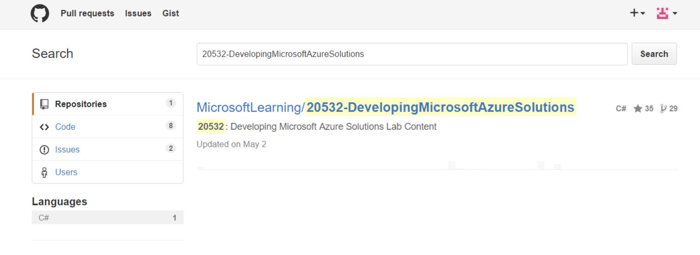
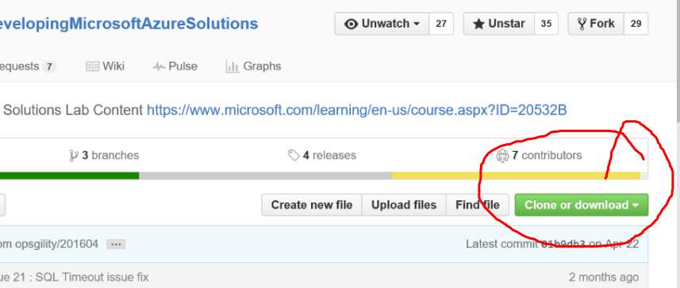
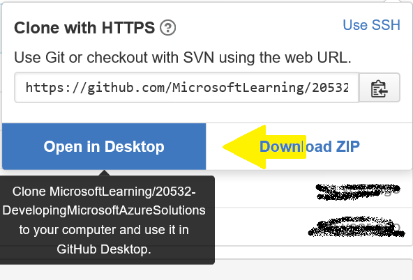

# Getting started with your course materials

This document contains the guidance to download lab and answer key .docx files for your courses. 

Your objective is to get the most up-to-date course materials. Use the procedure here to do that.

## Quickstart ##

If you are frequent user of PowerShell, you already have sync'd the Github repo on your system and installed the prerequisites, here are the simple instructions: 

Go this folder in your repo and then run the script.
`..\GitHub\20532-DevelopingMicrosoftAzureSolutions\Build`

Run this script:
`pandoc.ps1`

If you have not installed the prerequisites, here is the simple procedure to follow if you are familiar with GitHub and PowerShell.

1. Install Pandoc using the download.
2. Install PowerShell Community Extensions using the download.
3. Restart your computer.
4. Now you can run the script as needed.

## Prerequisites  ##
* Pandoc 1.13.2
  * Windows Installer: [https://github.com/jgm/pandoc/releases](https://github.com/jgm/pandoc/releases/tag/1.13.2)
* PowerShell Community Extensions 3.2.0
  * Installer: [http://pscx.codeplex.com/releases](http://pscx.codeplex.com/releases/view/133199)

> **Important**: After installing both prerequisites, you must restart the computer to use both components called by the script.

### Pandoc
Pandoc is a document converter used in the script to create the new .docx files used in your classes. If you do not install Pandoc, the script fails.

### PowerShell Community Extensions
The PowerShell Community Extensions are used to create the zip files that contain your .docx files. If you do not have the extensions installed, the script fails.

## The Pandoc.ps1 script
Pandoc.ps1 is a PowerShell script that extracts the appropriate information for your labs and the attendant answer keys.

PowerShell is a powerful tool and you need to "Run as Administrator" when you set it up to execute this script. Before you can execute the script, you must change the [Set-ExecutionPolicy](https://technet.microsoft.com/en-us/library/ee176961.aspx) to execute scripts without restriction. 

After changing the ExecutionPolicy property, scripts that you run have the power to do disruptive things to your computer. Use PowerShell knowing this and understand the state your computer is in when you run these scripts.

##Github
The labs are stored on Github in a repo. [Clone](https://help.github.com/articles/cloning-a-repository/) the repo before running the script. 

If you have previously cloned the repo and have a local copy on your computer, sync the repo to commit your changes and fetch any changes that were made to the branch you are in.

If GitHub and Git are new concepts, use the [guidance](https://guides.github.com/activities/hello-world/) on Github to get started.

[//]: # (Lots of Guidance exists for GitHub. Do we want to point to them? ) 

You can use other tools with GitHub if you have experience with other Git tools including Visual Studio, VS Code, or any of the Git command line tools widely available.

## Update the sources
1. Connect to [GitHub](GitHub.com).
2. Search GitHub for this project: 20532-DevelopingMicrosoftAzureSolutions

3. Click to open the link. 
4. Clone the repo.
 
5. Open the URL in the GitHub Desktop by clicking Open in Desktop.

6. Select a location for the repo on your computer.
7. To see the folders and run the script in the next procedure, right-click the project and click **Open in Explorer**.

## Running the script
Whenever you want to get new labs and answer keys, you can run this script. Like any Git repo, you must sync your sources to be sure you have all the latest changes. 

For more information on syncing your repo, see [Working with your remote repository on GitHub or GitHub Enterprise](https://help.github.com/desktop/guides/contributing/working-with-your-remote-repository-on-github-or-github-enterprise/).

###Running script using PowerShell
1. Open Explorer and navigate to location of the repo you cloned. Typically, it is in your documents folder:
` ..\Documents\GitHub\20532-DevelopingMicrosoftAzureSolutions\Build`
2. In the Build, folder, find the script: pandoc.ps1. Right-click the file, and **Run with PowerShell**.

3. When the script runs, you are prompted for a version. You can type any alphanumeric text that helps you identify your files,
> What is the current version?:
> 

4. After the script completes, you see two .zip file that contain your labs and the answer keys.
 
4. Open the files to see your new .docx for the course. Move these files to a new location.   to avoid adding them to the repo. In general, you should not add these files to the repo so do try not sync from the GitHub desktop.
