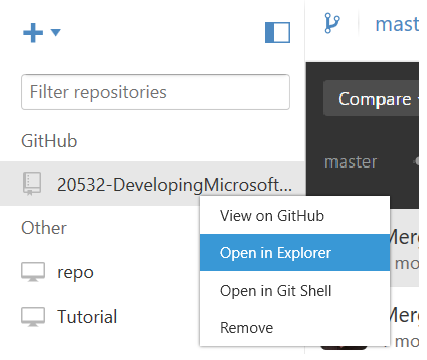

# Downloading and printing your course materials

The Microsoft Learning team recognzies the importance of making sure the training materials you use reflects the latest changes in cloud applications such as Microsoft Azure. In order to make sure the lab and lab answer keys for your classes are up-to-date, Microsoft has posted them to Github, where they will be updated as the underlying product user interface changes. This document contains the guidance to download and print lab and lab answer key .docx files for your course. This will allow you to ensure your students have the most up-to-date course materials for your students. 

## Quickstart ##

If you are frequent user of Windows PowerShell, you already have sync'd the Github repo for your course to your local computer previously, and you have installed the prerequisites, here are the simplest instructions: 

1. Sync (Clone) the repo for the course to your local computer to obtain the latest files.
2. Go the course folder in your local repo. For example:
  `..\GitHub\20532-DevelopingMicrosoftAzureSolutions\Build`
3. In WindowsPowershell, run this script **pandoc.ps1**:
  `.\pandoc.ps1`

## Overview Microsoft Learning's Github solution for course labs

The Microsoft Learning team has created a solution that allows the Microsoft team to regularly publish updated lab and lab answer keys (LAKs) to Github. That solution also includes a script and tools that will allow you to print the labs and lab answer keys from Microsoft Word .docx files. In order to use this solution you will need to perform the following steps the first time you wish to download and print the lab files:

1. Sign-up for a Github account.
2. Install Gitub Desktop
3. Install the prerequisite software:
  - Pandoc 1.13.2
  - PowerShell Community Extensions 3.2.0

Once you have signed up for Github and installed the prerequisite software, the steps for downloading and printing the course lab materials are the same for each course. The steps are those listed in the previous _Quickstart_ section:

1. Sync the repo for the course
2. In Windows PowerShell navigate to the \Build folder in the local course repo.
3. Run the pandoc.ps1 script. 

More detailed instructions are provided later in this document.

> **Note** Github has both a desktop client and a command line interface. Throughout this document we use the desktop client.

### Terminology
Using Github introduces terminology that may be new to you.  The following are some terms and concepts throughout this document.  For a full list of Github terms, see the [https://help.github.com/articles/github-glossary/](Github Glossary)

- **Git** and **Github** - Git is an open source change tracking program.  Github is a site/solution built on top of Git. There are other websites and solutions that use Git as their backend.  Github is used primarily for open source (public) development projects, and it is free for those projects. If you want to use Github for projects that are not open source (private), you must sign up for a pay version.

- **Repo** or **Repository** - Each project in Github is in a repository, or Repo for short. A repository contains all of a project's files, including documentation, and supports revision history. A repository can be either public or private. 

- **Markdown** - A text file format for creating documentation. It is text based and very simple to update, making it easy to collaborate. It is rendered by Github as HTML.

- **Fork** - A copy of someone else's repo that lives under your Github account, in comparison to a Branch, which lives in the orignial repo. See _Branch_.

- **Branch** - A branch is a copy of a reposotiory that lives in the same repository as the original. A branch can be _merged_ with the original.

- **Fetch** - Getting a copy of the latest changes from an online repo. A fetch does not _merge_ changes.

- **Pull** - Fetching the latest changes from an online repo and _merging_ them with any local changes.

- **Merge** - Applyng changes from one branch and applying them to another. This includes changes from an online repo and applying the changes to the local version of that repo

- **Pull request** - A set of proposed changes to a repo submitted by a user, that can either be accepted or rejected by owners or callaborators of a repo.

- **Push** - Sending (or submitting) your local changes to the online repo.

- **Collaborator** - A Github user that has permissions to add, delete, or change the content of a repository.

## Prerequisites  ##
Using Github and the Microsoft Learning courseware lab solution requires the following prerequisites:

### Signing up for a Github account
In order to clone a repo or collaborate with Microsoft Learning, you will need to sign up for a Github account

#### To sign up for a Github account
1. In your browser, navigate to [https://github.com/](https://github.com/).
2. In the **Pick a username** text box, enter a unique user name.
3. In the **Your email address** text box, enter your password.
4. In the **Create a password** text box, enter a password that meets Githubs complexity requirements.
5. Click **Sign up for Github**.
6. In the **Welcome to Github** page, make sure that **Unlimited public repositories for free** is selected.
7. Click **Finish sign up**.
8. Github will send a confirmation email to the email address you provided. When you receive the email, open it and click **Verify email address**.

### Installing Github Desktop
Github Desktop provides a graphical user interface (GUI) for Github, where you can perform the most common functions. There are some operations that can only be performed from the command line, but none of those are needed for downloading and printing lab files.

#### To install Github Desktop
1. In your browser, navigate to [https://desktop.github.com/](https://desktop.github.com/).
2. Click **Download Github Desktop**.
3. When the **GithubSetup.exe** file has downloaded, double-click the file to start the setup or click **Run** if prompted by Internet Explorer.
4. In the **Application Install - Security Warning** dialog, click **Install**.
5. 

* Pandoc 1.13.2
  * Windows Installer: [https://github.com/jgm/pandoc/releases](https://github.com/jgm/pandoc/releases/tag/1.13.2)
* PowerShell Community Extensions 3.2.0
  * Installer: [http://pscx.codeplex.com/releases](http://pscx.codeplex.com/releases/view/133199)

> **Important**: After installing both prerequisites, you must restart the computer to use both components called by the script.

### Pandoc
Pandoc is a document converter used in the script to create the new .docx files used in your classes. If you do not install Pandoc, the script fails.

### PowerShell Community Extensions
The PowerShell Community Extensions are used to create the zip files that contain your .docx files. If you do not have the extensions installed, the script fails.

## The Pandoc.ps1 script
Pandoc.ps1 is a PowerShell script that extracts the appropriate information for your labs and the attendant answer keys.

PowerShell is a powerful tool and you need to "Run as Administrator" when you set it up to execute this script. Before you can execute the script, you must change the [Set-ExecutionPolicy](https://technet.microsoft.com/en-us/library/ee176961.aspx) to execute scripts without restriction. 

After changing the ExecutionPolicy property, scripts that you run have the power to do disruptive things to your computer. Use PowerShell knowing this and understand the state your computer is in when you run these scripts.

##Github
The labs are stored on Github in a repo. [Clone](https://help.github.com/articles/cloning-a-repository/) the repo before running the script. 

If you have previously cloned the repo and have a local copy on your computer, sync the repo to commit your changes and fetch any changes that were made to the branch you are in.

If GitHub and Git are new concepts, use the [guidance](https://guides.github.com/activities/hello-world/) on Github to get started.

[//]: # (Lots of Guidance exists for GitHub. Do we want to point to them? ) 

You can use other tools with GitHub if you have experience with other Git tools including Visual Studio, VS Code, or any of the Git command line tools widely available.

## Detailed instructions
The following are the detailed instructions for cloning the repo and running the script. Course 20532 Developing Microsoft Azure Solutions is used as the example.

### Update the sources
1. Connect to [GitHub](GitHub.com).
2. Search GitHub for this project: 20532-DevelopingMicrosoftAzureSolutions

  

3. Click to open the link. 
4. Clone the repo.

   

5. Open the URL in the GitHub Desktop by clicking Open in Desktop.

  

6. Select a location for the repo on your computer.
7. To see the folders and run the script in the next procedure, right-click the project and click **Open in Explorer**.

### Running the script
Whenever you want to get new labs and answer keys, you can run this script. Like any Git repo, you must sync your sources to be sure you have all the latest changes. 

For more information on syncing your repo, see [Working with your remote repository on GitHub or GitHub Enterprise](https://help.github.com/desktop/guides/contributing/working-with-your-remote-repository-on-github-or-github-enterprise/).

#### Running script using PowerShell
1. Open Explorer and navigate to location of the repo you cloned. Typically, it is in your documents folder:

` ..\Documents\GitHub\20532-DevelopingMicrosoftAzureSolutions\Build`

2. In the Build, folder, find the script: pandoc.ps1. Right-click the file, and **Run with PowerShell**.

  

3. When the script runs, you are prompted for a version. You can type any alphanumeric text that helps you identify your files,

` What is the current version?:
` 

4. After the script completes, you see two .zip file that contain your labs and the answer keys.

  

5. Open the files to see your new .docx for the course. Move these files to a new location.   to avoid adding them to the repo. In general, you should not add these files to the repo so do try not sync from the GitHub desktop.

